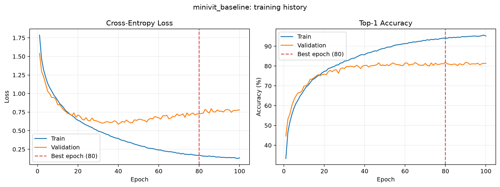
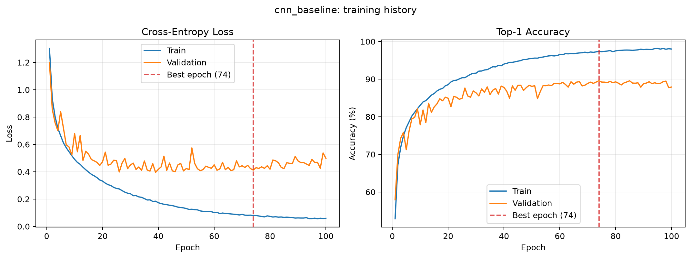
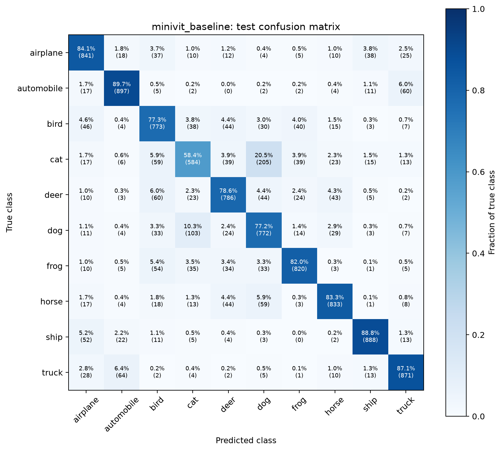
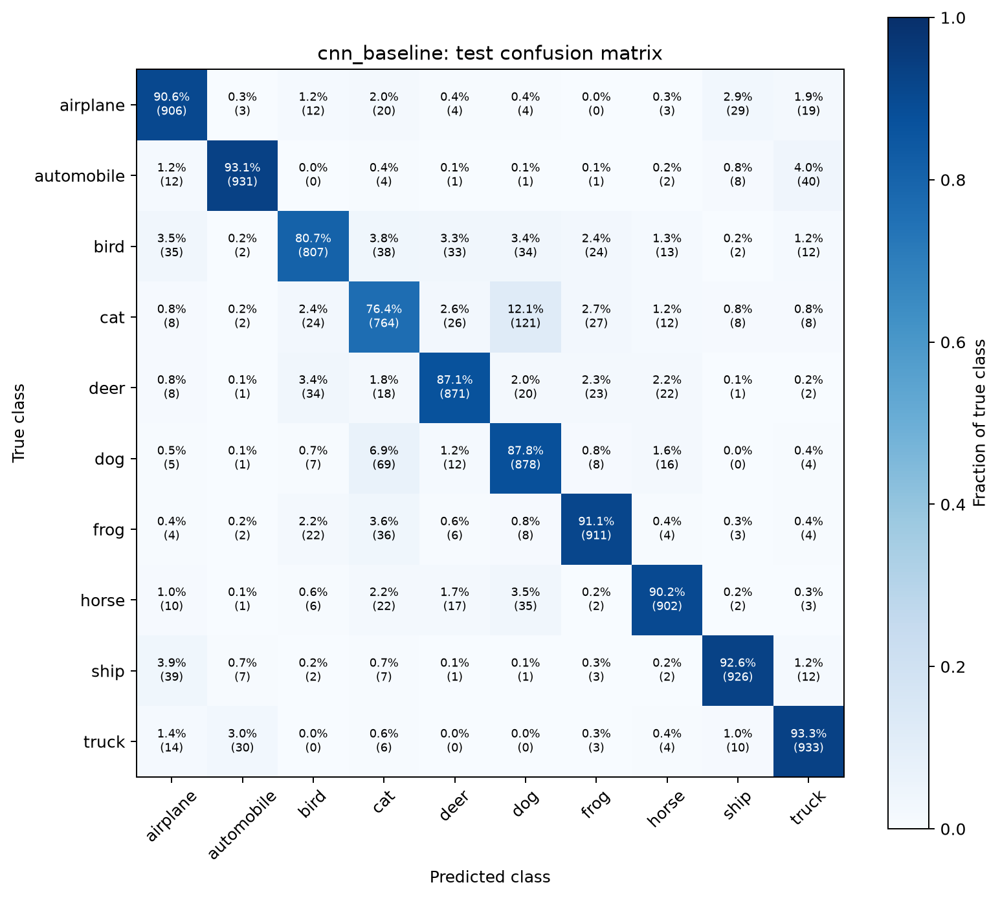
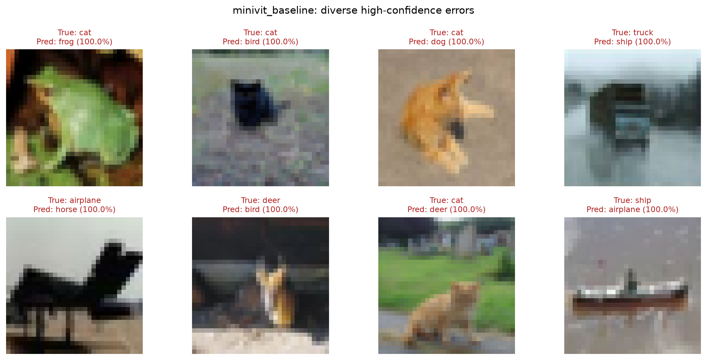
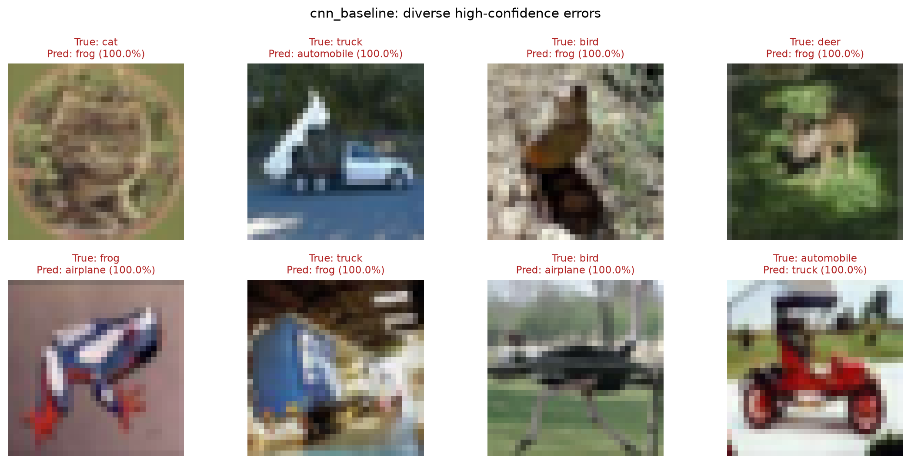
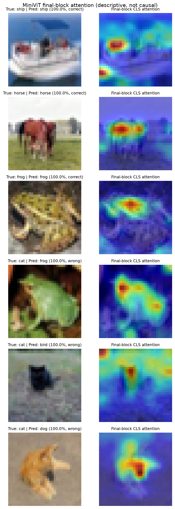

+# Mini ViT：从零实现 Vision Transformer 并完成 CIFAR-10 实验

这是一个面向学习与实验复现的 PyTorch 项目：不调用现成 ViT 模型，而是从零实现 Patch Embedding、Multi-Head Self-Attention、MLP、Transformer Encoder Block、CLS token、位置编码和分类头，并在 CIFAR-10 上完成训练、CNN 对照、三组消融实验、最终测试和注意力可视化。

项目强调的不是堆叠训练技巧或追求最高精度，而是建立一条正确、可运行、可解释、可测试、可复现的深度学习工程链路。

## 项目亮点

- 从零实现 MiniViT 核心结构，不依赖 `torchvision.models` 中的现成 ViT。
- 固定随机种子，将 CIFAR-10 官方训练集划分为 45,000 张训练图片和 5,000 张验证图片。
- 使用同一训练引擎比较 MiniViT 与参数量相近的 SimpleCNN。
- 完成 Patch Size、Encoder Depth、Data Augmentation 三组单变量消融实验。
- 支持 YAML 配置、逐 epoch 日志、最佳/最新 checkpoint 和断点续训。
- 冻结模型后统一评估官方 10,000 张测试图片，并保存逐样本预测。
- 生成训练曲线、混淆矩阵、高置信错误案例和最后一层 CLS Attention 热力图。
- 使用 pytest 覆盖数据、模型 shape/梯度、tiny overfit、训练引擎、评估入口和可视化契约。

## 最终结果

所有模型都训练 100 epoch，并根据验证准确率选择唯一的 `best.pt`。模型与配置全部冻结后，才在 CIFAR-10 官方测试集上进行完整评估；测试结果没有用于重新调参。

| 模型 / 实验 | 参数量 | Best Val Acc | Best Epoch | Test Loss | Test Acc |
|---|---:|---:|---:|---:|---:|
| SimpleCNN baseline | 2,609,002 | **89.58%** | 74 | **0.4514** | **88.29%** |
| MiniViT baseline（p4 / d6 / aug） | 2,693,578 | 81.84% | 80 | 0.7335 | 80.65% |
| MiniViT depth 9 | 4,028,170 | 81.46% | 96 | 0.8347 | 80.36% |
| MiniViT depth 3 | 1,358,986 | 81.16% | 95 | 0.7347 | 80.27% |
| MiniViT patch 2 | 2,723,530 | 80.02% | 51 | 0.7653 | 78.94% |
| MiniViT patch 8 | 2,712,010 | 77.30% | 76 | 0.8077 | 76.38% |
| MiniViT no augmentation | 2,693,578 | 72.64% | 94 | 1.5201 | 70.93% |

详细的训练指标、实验条件、耗时和 checkpoint SHA-256 见 [实验结果总账](notes/EXPERIMENT_RESULTS.md)。

## 核心结论

### MiniViT 与 CNN

CNN 的测试准确率比 MiniViT 高 7.64 个百分点，平均每个 epoch 约为 10.75 秒，而 MiniViT 约为 25.64 秒。在当前 32×32 小图像、45,000 张训练图片和基础增强协议下，卷积的局部性与平移相关归纳偏置带来了更高的数据效率和计算效率。

这不是“CNN 永远优于 ViT”的结论，而是说明基础 ViT 在小数据训练中更依赖充分数据、正则化和优化策略。

### Patch Size

测试准确率排序为：

```text
patch 4（80.65%）> patch 2（78.94%）> patch 8（76.38%）
```

Patch 2 保留了更细的局部结构，但产生 256 个图像 token，注意力计算和优化成本显著增加；Patch 8 只有 16 个图像 token，训练最快，但对 CIFAR-10 的空间压缩过强。Patch 4 在信息保留、计算成本和泛化之间取得了更好的平衡。

### Encoder Depth

Depth 3、6、9 的测试准确率分别为 80.27%、80.65%、80.36%。增加到 9 层没有带来可见收益；3 层以约一半参数量得到非常接近的结果。由于每个配置只运行 seed 42，微小差异可能包含随机波动，因此只能说“当前协议未观察到加深收益”。

### Data Augmentation

移除 RandomCrop 与 RandomHorizontalFlip 后，训练准确率更高，但测试准确率从 80.65% 降至 70.93%。这说明模型更容易记忆固定训练图片，却显著损失了对未见数据的泛化能力；基础数据增强是当前 MiniViT 的关键正则化来源。

## 模型结构

MiniViT baseline 的输入和张量变化：

```text
Image
[B, 3, 32, 32]
  │
  ▼
Patch Embedding: Conv2d(kernel=4, stride=4)
[B, 192, 8, 8]
  │ flatten + transpose
  ▼
Patch Tokens
[B, 64, 192]
  │ prepend learned CLS token
  ▼
Token Sequence
[B, 65, 192]
  │ add learned positional embedding
  ▼
6 × Pre-Norm Transformer Encoder Block
[B, 65, 192]
  │
  ▼
Final LayerNorm → take CLS token
[B, 192]
  │
  ▼
Linear Classifier
[B, 10] logits
```

每个 Encoder Block 使用 Pre-Norm 与残差连接：

```python
x = x + attention(norm1(x))
x = x + mlp(norm2(x))
```

baseline 配置：

| 参数 | 数值 |
|---|---:|
| Image Size | 32 |
| Patch Size | 4 |
| Image Tokens | 64 |
| Embedding Dimension | 192 |
| Encoder Depth | 6 |
| Attention Heads | 6 |
| Head Dimension | 32 |
| MLP Dimension | 768 |
| Dropout | 0.1 |
| Classes | 10 |

## 可视化结果

### 训练过程

| MiniViT | SimpleCNN |
|---|---|
|  |  |

MiniViT 与 CNN 后期都出现训练准确率继续提高、验证 loss 上升的过拟合现象，但 CNN 的验证性能平台明显更高。

### 混淆矩阵

| MiniViT | SimpleCNN |
|---|---|
|  |  |

矩阵纵轴是真实类别，横轴是预测类别，并按真实类别做行归一化。两种模型都容易混淆外观接近的 `cat ↔ dog` 和 `automobile ↔ truck`。MiniViT 的 cat 类准确率为 58.4%，CNN 提高到 76.4%。

### 高置信错误案例

| MiniViT | SimpleCNN |
|---|---|
|  |  |

错误案例先按置信度排序，再优先覆盖不同的“真实类别 → 预测类别”组合，避免整张图只展示同一种错误。

### Attention 热力图



热力图取最后一个 Encoder Block 中 CLS query 指向 64 个 patch key 的注意力，对 6 个 head 求平均后恢复为 8×8 网格，并插值到 32×32。它只能描述该层如何分配注意力权重，不能证明高亮区域对预测具有因果作用。

## 项目结构

```text
Mini-ViT/
├── README.md
├── PROJECT_PLAN.md
├── requirements.txt
├── configs/
│   ├── minivit.yaml
│   ├── cnn.yaml
│   └── ablations/
│       ├── patch_p2.yaml
│       ├── patch_p8.yaml
│       ├── depth_d3.yaml
│       ├── depth_d9.yaml
│       └── no_augmentation.yaml
├── notes/
│   ├── BASIC_PROJECT_WORKFLOW.md
│   ├── EXPERIMENT_RESULTS.md
│   └── STAGE_0_NOTES.md ... STAGE_9_NOTES.md
├── src/
│   ├── config.py
│   ├── data.py
│   ├── engine.py
│   ├── metrics.py
│   ├── utils.py
│   ├── visualization.py
│   └── models/
│       ├── minivit.py
│       └── cnn.py
├── scripts/
│   ├── train.py
│   ├── evaluate.py
│   └── visualize.py
├── tests/
├── assets/
├── data/       # Git ignored
└── outputs/    # Git ignored
```

代码职责：

- `src/`：可复用的数据、模型、训练、指标和绘图逻辑。
- `scripts/`：训练、最终评估和图表生成的命令行入口。
- `configs/`：模型、数据和训练超参数。
- `tests/`：自动化契约和回归测试。
- `notes/`：逐阶段学习笔记、工作流和实验总账。
- `outputs/`：本地 checkpoint、日志和逐样本预测，不提交 Git。
- `assets/`：用于报告和 README 的轻量图表。

## 环境要求

本项目最终验收环境：

```text
OS: Windows
Python: 3.14.0
PyTorch: 2.14.0+cu130
torchvision: 0.29.0+cu130
CUDA runtime reported by PyTorch: 13.0
```

完整直接依赖及固定版本见 [requirements.txt](requirements.txt)。当前 requirements 使用 PyTorch CUDA 13.0 wheel；若设备或平台不同，应根据 [PyTorch 官方安装说明](https://pytorch.org/get-started/locally/) 选择匹配版本，再安装其余依赖。

## 快速开始

### 1. 克隆仓库

```powershell
git clone https://github.com/XDkoala/Mini-ViT.git
cd Mini-ViT
```

### 2. 创建并激活虚拟环境

Windows PowerShell：

```powershell
python -m venv .venv
.\.venv\Scripts\Activate.ps1
```

确认当前解释器：

```powershell
python -c "import sys; print(sys.executable)"
```

### 3. 安装依赖

```powershell
python -m pip install --upgrade pip
python -m pip install -r requirements.txt
python -m pip check
```

### 4. 运行测试

```powershell
python -m pytest -q
```

阶段 9 收尾时，全量测试结果为：

```text
184 passed
```

### 5. 数据准备

无需手工编写下载脚本。首次训练或评估时，`torchvision.datasets.CIFAR10` 会把数据下载到 `data/` 并解压。该目录已被 Git 忽略。

若网络下载中断，torchvision 的自动下载不保证断点续传；可以使用支持续传的工具下载 CIFAR-10 压缩包并放入 `data/`，再由 torchvision 完成校验和解压。

## 训练

### 隔离的冒烟训练

先使用少量 batch 验证数据、模型、训练、验证、日志和 checkpoint 链路。限制 batch 时必须指定独立输出目录，防止覆盖正式结果：

```powershell
python -m scripts.train --config configs/minivit.yaml --epochs 2 --max-batches 2 --output-dir outputs/smoke_minivit
```

### 正式训练

MiniViT：

```powershell
python -m scripts.train --config configs/minivit.yaml
```

SimpleCNN：

```powershell
python -m scripts.train --config configs/cnn.yaml
```

每个实验输出：

```text
outputs/<experiment>/
├── config.yaml
├── history.csv
├── best.pt
└── last.pt
```

`best.pt` 由最高验证准确率选择，用于最终评估；`last.pt` 保存最后完成的 epoch，用于断点续训。

### 断点续训

```powershell
python -m scripts.train --config configs/minivit.yaml --resume outputs/minivit_baseline/last.pt
```

配置中的 `training.epochs` 或命令行 `--epochs` 表示目标总 epoch，而不是从 checkpoint 起额外训练的轮数。

## 消融实验

```powershell
python -m scripts.train --config configs/ablations/patch_p2.yaml
python -m scripts.train --config configs/ablations/patch_p8.yaml
python -m scripts.train --config configs/ablations/depth_d3.yaml
python -m scripts.train --config configs/ablations/depth_d9.yaml
python -m scripts.train --config configs/ablations/no_augmentation.yaml
```

每个配置拥有独立 `output_dir`，不会覆盖 baseline 或其他实验。

## 最终评估

仓库不提交大型 checkpoint。请先完成对应训练，再评估验证集选出的 `best.pt`：

```powershell
python -m scripts.evaluate --checkpoint outputs/minivit_baseline/best.pt
python -m scripts.evaluate --checkpoint outputs/cnn_baseline/best.pt
```

评估脚本拒绝 `last.pt`，并默认写入：

```text
outputs/<experiment>/evaluation/
├── metrics.json
└── predictions.csv
```

`metrics.json` 记录 test loss、test accuracy、样本数、checkpoint epoch 与 SHA-256；`predictions.csv` 为每个测试样本记录真实标签、预测标签、预测置信度和正确性。

局部评估只能写入隔离目录：

```powershell
python -m scripts.evaluate --checkpoint outputs/minivit_baseline/best.pt --max-batches 2 --output-dir outputs/evaluation_smoke
```

## 生成可视化

完成 MiniViT/CNN baseline 的正式训练和评估后运行：

```powershell
python -m scripts.visualize
```

脚本从固定的 `history.csv`、`predictions.csv` 和 MiniViT `best.pt` 生成 `assets/` 中的 7 张图，不重新训练，也不重新选择模型。

## 配置说明

baseline YAML 包含四个部分：

```yaml
experiment:
  name: minivit_baseline
  output_dir: outputs/minivit_baseline

seed: 42
device: auto

data:
  data_dir: data
  batch_size: 128
  num_workers: 0
  augmentation: basic

model:
  name: minivit
  image_size: 32
  patch_size: 4
  embed_dim: 192
  depth: 6
  num_heads: 6
  mlp_dim: 768
  dropout: 0.1

training:
  epochs: 100
  optimizer: adamw
  learning_rate: 0.0003
  weight_decay: 0.05
```

`device: auto` 优先使用 CUDA，否则退回 CPU。Windows 下默认 `num_workers: 0`，减少多进程 DataLoader 的兼容问题。

## 测试与质量保证

自动化测试主要验证：

- CIFAR-10 划分可复现且训练/验证索引不重叠。
- 训练、验证和测试使用正确的变换。
- Patch Embedding、Attention、MLP、Encoder 与完整模型 shape 正确。
- Attention 每行概率和接近 1，关键参数能够获得有限梯度。
- MiniViT 与 CNN 都能通过 tiny overfit。
- epoch loss 按样本数加权，评估过程不修改参数。
- checkpoint、history、配置快照与断点续训正确。
- 最终评估只加载 `best.pt`，并隔离 partial smoke 输出。
- 混淆矩阵方向、错误样本选择和 Attention 网格还原正确。

运行单个测试文件示例：

```powershell
python -m pytest tests/test_model.py -q
python -m pytest tests/test_engine.py -q
python -m pytest tests/test_visualization.py -q
```

## 可复现性与实验规范

- seed 42 固定 Python、NumPy、PyTorch、训练/验证划分与 DataLoader 初始生成器。
- 验证集和测试集不使用随机增强。
- 每次正式运行保存有效 `config.yaml`，不只依赖仓库中的初始配置。
- checkpoint 保存模型、优化器、epoch、完整 history、最佳验证准确率和配置。
- 最终指标绑定 checkpoint SHA-256。
- 测试集只在实验矩阵冻结后使用。
- 所有正式实验的事实与异常记录保留在 [EXPERIMENT_RESULTS.md](notes/EXPERIMENT_RESULTS.md)。

固定 seed 能提高复现性，但不同 GPU、CUDA、PyTorch 算法实现和并行执行仍可能产生细微数值差异。

## 已知限制

- 每个正式配置只运行一个随机种子，无法估计均值与方差。
- 未使用学习率 warmup、scheduler、AMP、Mixup、CutMix 或 label smoothing。
- 没有报告 FLOPs、吞吐量、单张延迟和峰值显存。
- 数据集只有 CIFAR-10，结论不能直接推广到 ImageNet 或真实机器人视觉。
- Attention 热力图不是因果解释，也不是完整的 Attention Rollout。
- 当前目标是基础工程闭环，不包含部署、Web Demo、目标检测或分割。

## 后续方向

1. 使用 3 个以上随机种子报告均值与标准差。
2. 加入 warmup + cosine decay，单独记录为新实验协议。
3. 比较 Mixup、CutMix 与 label smoothing。
4. 统计 FLOPs、吞吐量、延迟和显存占用。
5. 与标准 ResNet-18 或更成熟的小图像 ViT 方法比较。
6. 在第一视角或具身视觉数据上进行迁移学习与域偏移分析。

后续实验应建立新的验证协议，不应覆盖当前冻结的基础结果，也不应反复利用 CIFAR-10 test split 调参。

## 学习笔记

- [基础项目工作流](notes/BASIC_PROJECT_WORKFLOW.md)
- [阶段 0：环境与项目骨架](notes/STAGE_0_NOTES.md)
- [阶段 1：CIFAR-10 数据管线](notes/STAGE_1_NOTES.md)
- [阶段 2：MiniViT 基础零件](notes/STAGE_2_NOTES.md)
- [阶段 3：完整 MiniViT](notes/STAGE_3_NOTES.md)
- [阶段 4：Tiny Overfit](notes/STAGE_4_NOTES.md)
- [阶段 5：正式训练管线](notes/STAGE_5_NOTES.md)
- [阶段 6：SimpleCNN 基线](notes/STAGE_6_NOTES.md)
- [阶段 7：消融实验](notes/STAGE_7_NOTES.md)
- [阶段 8：最终评估与可视化](notes/STAGE_8_NOTES.md)
- [阶段 9：README 与仓库收尾](notes/STAGE_9_NOTES.md)
- [实验结果总账](notes/EXPERIMENT_RESULTS.md)

## 许可证

当前仓库尚未添加 LICENSE 文件。在复用或分发代码前，请先补充合适的开源许可证。

## 致谢与参考

- [An Image is Worth 16x16 Words: Transformers for Image Recognition at Scale](https://arxiv.org/abs/2010.11929)
- [PyTorch Documentation](https://pytorch.org/docs/stable/)
- [Torchvision CIFAR-10](https://pytorch.org/vision/stable/generated/torchvision.datasets.CIFAR10.html)
